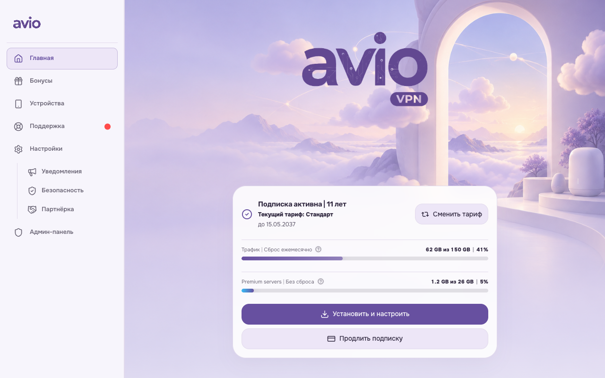
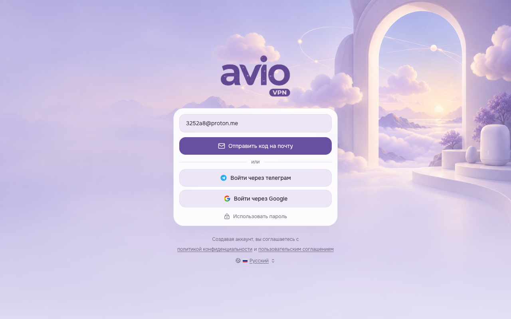
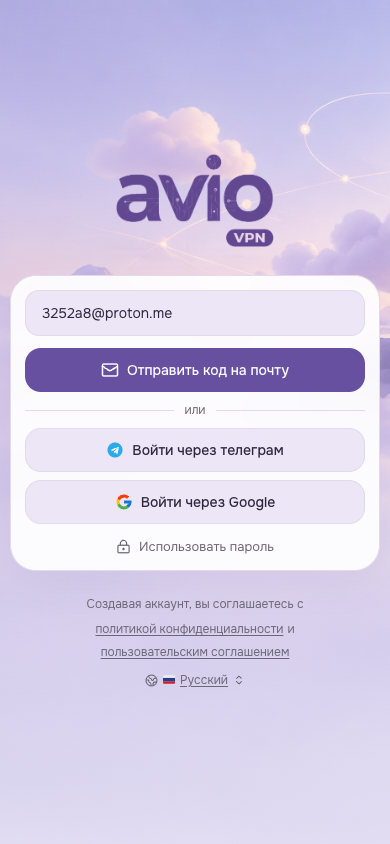
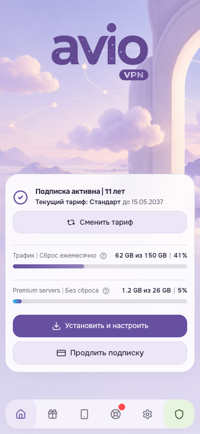
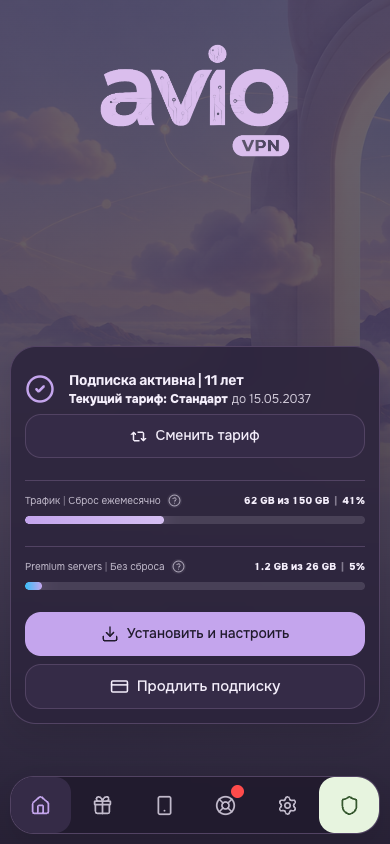
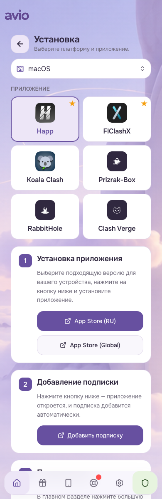
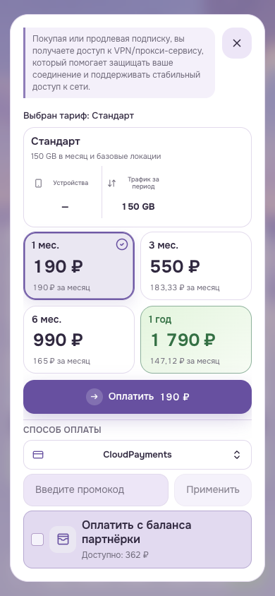
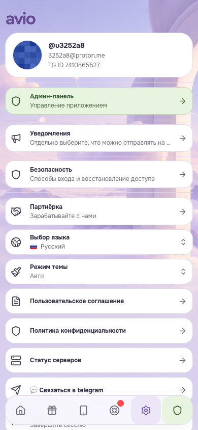
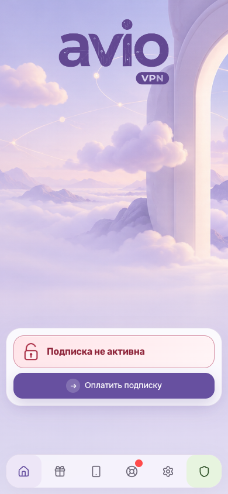
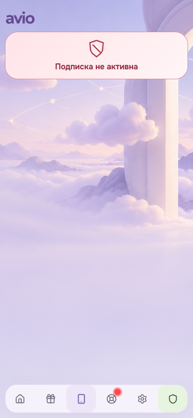

# Avio — Твой интернет

Версия 1.5.15: стартовый экран сайта использует панорамный фон темы, увеличенный
новый фиолетовый логотип Avio с плашкой VPN и компактную шапку без дублирующего
названия сервиса. Форма входа остаётся читаемой на десктопе и мобильных экранах.

Установить тему можно по адресу этого публичного репозитория или ZIP-архивом
из раздела Releases.

Тема minishop на основе лендинга Avio: лавандовая палитра, панорамный фон главной,
округлые карточки и кнопки. В версии 1.3.3 панорамный фон используется на всех
вкладках личного кабинета с нижней навигацией. Светлый режим повторяет лендинг; тёмный сохраняет
фиолетовую палитру и использует светлый лавандовый акцент.

## Скриншоты

| Вход на мобильном | Главная |
| --- | --- |
|  |  |

| Главная | Тёмный режим | Установка |
| --- | --- | --- |
|  |  |  |

| Выбор тарифа | Настройки |
| --- | --- |
|  |  |

| Неактивная подписка | Экран устройств без подписки |
| --- | --- |
|  |  |

Версия 1.3.0: единая поверхность главной с разделителями трафика, кнопки с
радиусом 16 px, контрастная типографика, стеклянная навигация и короткие переходы.
Поддерживается расширенный редактор тем Core от 14.09.2026.
Сохранены панорамный фон, крупный логотип с VPN на главной, компактный логотип
без VPN на внутренних страницах и светло-зелёная кнопка «Админ-панель».

## Установка

1. В minishop откройте **Админка → Внешний вид → Добавить темы**.
2. Загрузите `avio-landing-theme.zip`, проверьте карточку и установите тему.
3. Откройте предпросмотр **Avio — Твой интернет**, затем нажмите **Активировать**.
4. В настройках бренда загрузите `images/avio-logo.png` из распакованного пакета.
   Логотип и название сервиса настраиваются отдельно от темы.
5. При необходимости включите пользовательский выбор светлого/тёмного режима.

Для обновления уже установленной Avio выберите **Обновить и сохранить настройки**
при импорте ZIP. Ключ `avio-landing` и оба варианта сохранены.

## Настройка в новом редакторе

Откройте настройки карточки Avio в библиотеке тем и выберите светлый или тёмный вариант.

- **CSS-цвета**: переменные `--avio-backdrop-*` управляют оттенком и затемнением
  поверх фоновой картинки; `--avio-admin-*` — зелёной кнопкой админ-панели;
  `--avio-peach*` и `--avio-sky*` — дополнительными акцентами инструкций.
  Core обнаруживает эти переменные в CSS; вписывать `css_variables` в JSON не нужно.
- **Прозрачность**: 100 сохраняет исходный вид; уменьшение делает фоны основных
  карточек и общей подложки на главной прозрачнее. Текст и элементы управления
  не получают `opacity`. Цветовая прозрачность отдельных поверхностей задаётся
  также через их цвет. Значение по умолчанию — 100.
- **Шрифты**: основной и брендовый шрифты берутся из `font_sans` и `font_logo`.
  По умолчанию используются локальные Onest/Rubik. Сохраняется шрифт флагов Core.
- **Масштаб логотипа**: настройки desktop/mobile работают; на узком экране
  логотип ограничен шириной контейнера. Главная сохраняет плашку VPN.
- Выпадающие меню языка, режима, платформ и поддержки следуют токенам палитры
  и шрифта, в том числе после их изменения владельцем.

Настройки сохраняются отдельно от файлов автора. Загружать новый логотип
при каждом обновлении темы не требуется, если Avio уже выбран в настройках бренда.

В версии 1.3.1 штатная кнопка админ-панели также показана в нижней навигации
для администраторов. CSS раскрывает существующую кнопку Core; проверка роли
и обработчик перехода не меняются. У остальных пользователей нет лишней ячейки.
Патч Core и пересборка приложения для этой темы не требуются.

Ключ темы — `avio-landing`. Он отличается от старых заготовок `avio` и
`avio-space`, поэтому новая тема не заменяет их при первой установке.

Тема по умолчанию применяется к личному кабинету, а применение к админке
выключено (`use_in_admin: false`). Существующие данные, тарифы и сценарии оплаты
определяет minishop. Установка темы не изменяет тексты и бизнес-логику.

## Состав

- `theme.json` — палитры, шрифты, радиусы и режимы.
- `style.css` — оформление существующих элементов minishop.
- `images/avio-background-v2.png` — новая декоративная иллюстрация с облаками и порталом.
- `images/avio-logo.png` — исходный прозрачный логотип Avio; CSS окрашивает
  логотипы бренда в палитру выбранного режима.
- `fonts/Onest.ttf`, `fonts/Rubik.ttf` — оригинальные локальные шрифты.
- `fonts/*-OFL.txt` — лицензии шрифтов SIL OFL 1.1.

Внешних CSS, Google Fonts-запросов и исполняемого кода в пакете нет.
Иллюстрация декоративная и не перехватывает нажатия. Состояния ошибок,
недоступных кнопок, выбранных тарифов и фокус клавиатуры сохраняются.

## Совместимость и проверка

Формат пакета: `theme_api: 1`. База проверки — main и dev на одном
коммите `81faeab` от 14 сентября 2026 года. Для новых CSS-настроек нужен Core
с поддержкой `css_variables_by_variant` и токена `transparency`.

Локальная проверка использует штатный Python-валидатор пакетов и Svelte demo
minishop. Демо заменяет API демонстрационными данными: реальные платежи,
авторизация и установка на действующем сервере этой проверкой не покрываются.
Для версии 1.2.0 проверены 11 клиентских экранов/состояний в двух режимах и четырёх размерах.
Отдельно проверены обнаружение CSS-цветов штатным backend, переопределение
цветов/шрифтов/прозрачности в рендерере Core, меню вне app-shell, масштаб 300%,
импорт ZIP в демо и встроенный скриншот 1280×800.

Основные цвета текста имеют контраст не менее 4,5:1 относительно соответствующего
основного фона. Это проверка выбранных цветовых пар, а не аудит всей доступности.

Тема предназначена для проекта Avio. Условия на бренд, иллюстрации и шрифты
описаны в `LICENSE` и файлах лицензий шрифтов.
