# Avio Dock — Твой интернет

Версия 1.8.0, ключ `avio-dock`, ветка `avio-dock`. Это Avio Flow 1.7.0, переосмысленный
как «рабочий стол»: панорама — обои, навигация — док, экраны — стеклянные окна.
Тема ставится рядом с `avio-landing`, `avio-next` и `avio-flow`.

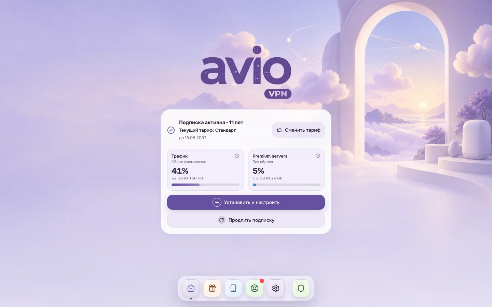

## Идея

Прежние версии оставались телефонным интерфейсом, растянутым на десктоп: колонка 250 px
слева, узкая карточка по центру, на широком экране строки настроек в тысячу пикселей.
Avio Dock строит десктоп вокруг панорамы и переносит на телефон то, что там естественно.

**Док вместо левой колонки.** Та же навигация Core, но плавающая панель внизу по центру,
как в macOS:
- у каждого раздела своя цветная плитка (главная, бонусы, устройства, поддержка,
  настройки, партнёрка, админ-панель);
- название всплывает над плиткой при наведении или фокусе с клавиатуры;
- под текущим разделом точка; соседние плитки приподнимаются вслед за наведённой;
- админ-панель отделена чертой, бейджи непрочитанного остаются на плитках.

Панорама получает всю ширину экрана. Подпункты настроек из колонки не пропадают: они
есть на экране «Настройки». Разделы плагинов Core выводит той же разметкой, поэтому
они тоже становятся плитками (с настоящим плагином это не проверялось).

**Главная — герой слева.** Логотип и карточка подписки выровнены по левой линии, арка
на панораме справа остаётся открытой. По той же линии стоит форма входа.

**Экраны — окна.** Бонусы, устройства, поддержка, настройки и установка лежат в одном
стеклянном окне шириной до 940 px с логотипом над ним. Настройки идут двумя колонками,
во всю ширину остаются профиль, уведомления, безопасность и «Выйти».

**Оплата — панель, а не всплывающее окно.** На десктопе чекаут и выбор тарифа выезжают
справа на всю высоту: экран за ними остаётся виден, всё помещается без прокрутки.
На телефоне это нижний лист с закруглёнными верхними углами, кнопка оплаты у большого
пальца.

**Трафик — плитки.** Когда есть обычный и премиум-трафик, они стоят рядом двумя плитками
с процентом крупно, объёмом под ним и полосой внизу. Раскрытие деталей по нажатию
сохранено.

**Телефонная панель.** Активная вкладка окрашивается цветом своей плитки из дока.

Всё сделано средствами темы, без изменений Core, текстов и логики.

| Док вблизи | Настройки | Оплата |
| --- | --- | --- |
| 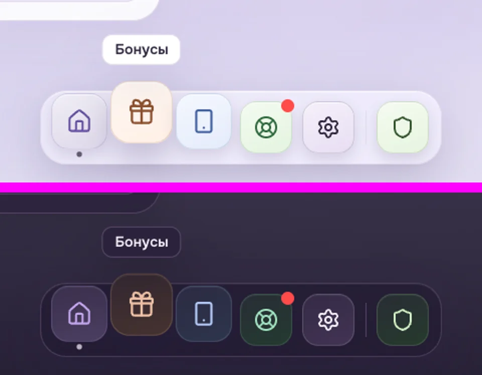 | 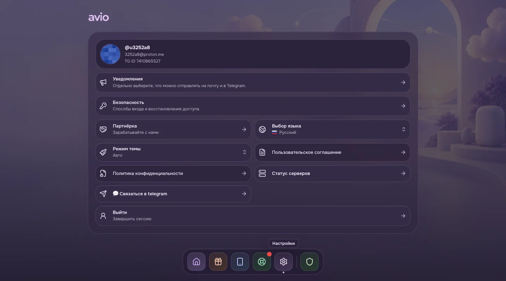 | 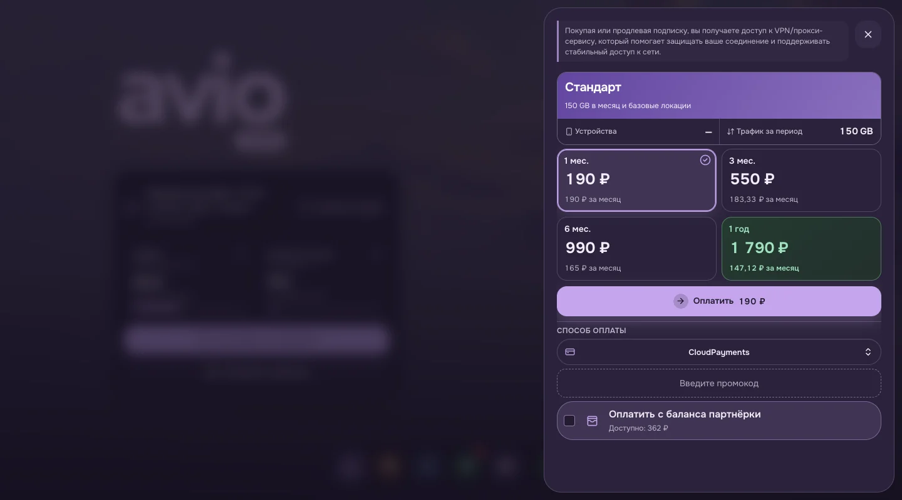 |

| Главная, тёмный режим | Установка | Вход |
| --- | --- | --- |
| 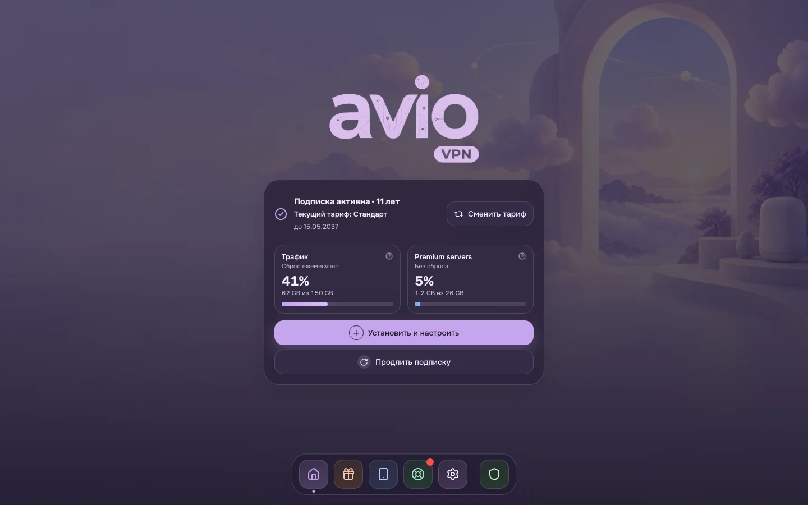 | 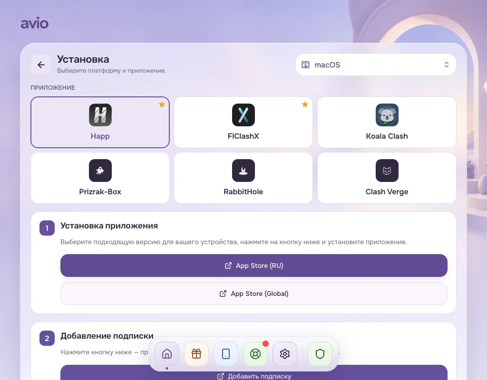 | 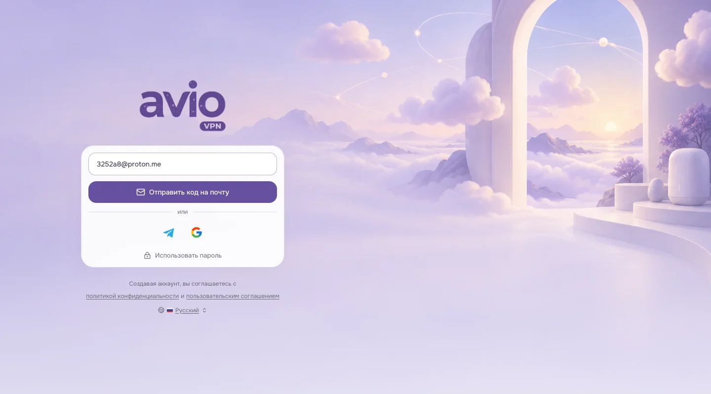 |

## Что уже было в Avio Flow 1.7.0 (воронка покупки)

Всё сделано средствами темы, без изменений Core, текстов и бизнес-логики.

**Главное действие на главной зависит от ситуации.** Одна кнопка главная, остальные
вторичные:

| Состояние | Главная кнопка | Почему |
| --- | --- | --- |
| Подписка в порядке | «Установить и настроить» | человеку нужен доступ, не покупка |
| Подписка скоро истекает | «Продлить подписку», поднята наверх | продление важнее установки |
| Трафик закончился | «Добавить трафик», поднята наверх | сейчас нужна именно эта покупка |
| Нет подписки, доступен триал | кнопка триала | бесплатный шаг проще, «Оплатить» рядом как вторичная |
| Нет подписки, триала нет | «Оплатить подписку», крупнее (52 px) | единственная цель экрана |

Раньше при закончившемся трафике «Добавить трафик» была третьей вторичной кнопкой,
а при доступном триале две одинаковые главные кнопки спорили друг с другом.

**Кнопка оплаты всегда на экране.** В чекауте и в выборе тарифа кнопка «Оплатить» или
«Далее» прилипает к низу окна, пока до её места не долистали. На 375×667 и при открытых
слайдерах тарифа оплата больше не уходит за край. Порядок блоков прежний: кнопка
сразу под периодами. Неактивная «Далее» непрозрачная, чтобы под ней не просвечивал список.

**Промокод не отвлекает.** Пока поле пустое и не в фокусе, это одна пунктирная строка
без кнопки «Применить». Кнопка появляется при касании. Заметное пустое поле промокода
заставляет часть покупателей уйти искать код и не вернуться.

**Выбор тарифа выглядит как выбор.** Вместо стрелки у невыбранных тарифов пустой кружок,
у выбранного галочка Core. Стрелка обещала переход по нажатию, а нажатие только выбирало.

**Подписи в нижней навигации.** Core прячет их, когда пунктов пять и больше. Иконки подарка,
телефона и спасательного круга без подписи угадываются плохо. От 375 до 460 px подписи
возвращены. У админ-панели остаётся только иконка, её ячейка уже, поэтому у админа тоже всё
помещается.

**Бонусы.** «Подарить» (покупка подарка) — главная кнопка экрана, копирование ссылки
на уже купленный подарок — вторичная.

## Что стоит сделать в Core и админке

Это не решается темой, но заметно влияет на конверсию:

1. **Цена в списке тарифов.** Сейчас там только объём трафика, цену видно лишь на
   следующем шаге. Строка «от 147 ₽/мес» у каждого тарифа.
2. **Экономия на длинных периодах.** Бейдж «−23%» у «1 года» по сравнению с помесячной оплатой.
3. **Выбор периода по умолчанию.** Сейчас выбран «1 месяц». Стоит проверить в A/B
   выбор по умолчанию самого выгодного или последнего купленного периода.
4. **Кнопка оплаты на «Устройствах» без подписки.** Сейчас это тупик: карточка
   «Подписка не активна» и больше ничего.
5. **Предложение на главной без подписки.** Одна строка ценности и цена «от …»
   рядом с «Оплатить подписку».
6. **Админка: название способа оплаты.** «CloudPayments» стоит переименовать в понятное
   покупателю, например «Банковская карта».
7. **Админка: описание покупки.** Текст «Покупая или продлевая подписку…» занимает 4–6 строк
   вверху чекаута на каждом шаге. Одно короткое предложение вернёт место периодам.
8. **Для тем:** `lang` у `<html>` по языку пользователя и data-атрибуты с ключом
   тарифа и длиной периода. Тогда тема сможет переводить свои надписи и выделять
   тариф и период без привязки к порядку.

## Скриншоты

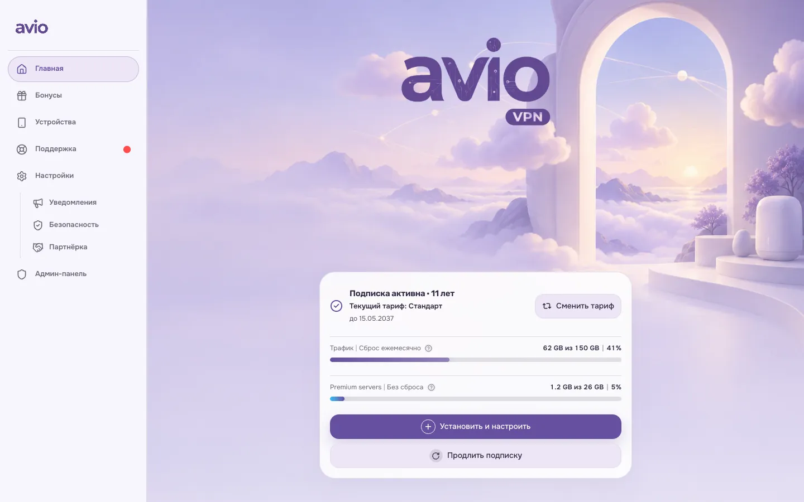

| Триал | Трафик закончился | Подписка истекает |
| --- | --- | --- |
| 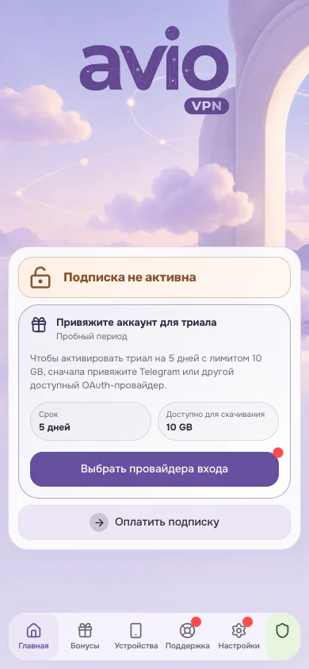 | 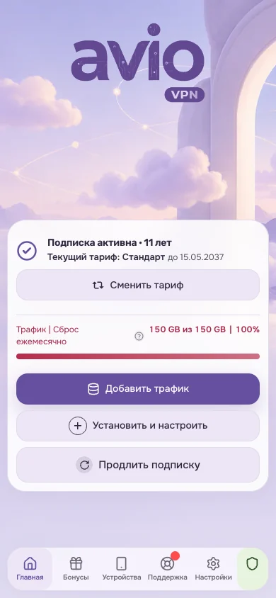 | 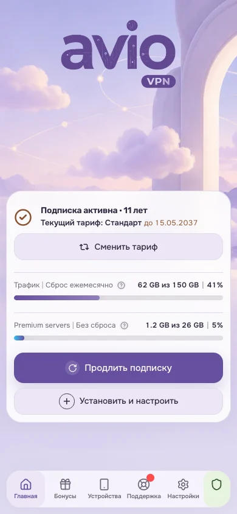 |

| Оплата на 375×667 | Выбор тарифа на 375×667 | Бонусы |
| --- | --- | --- |
| 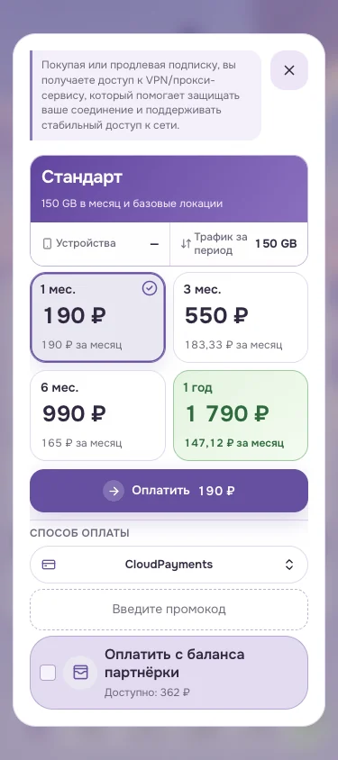 | 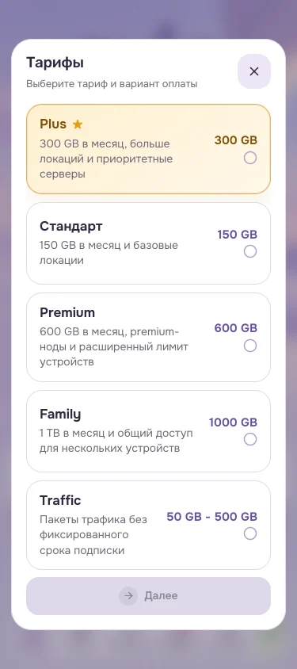 | 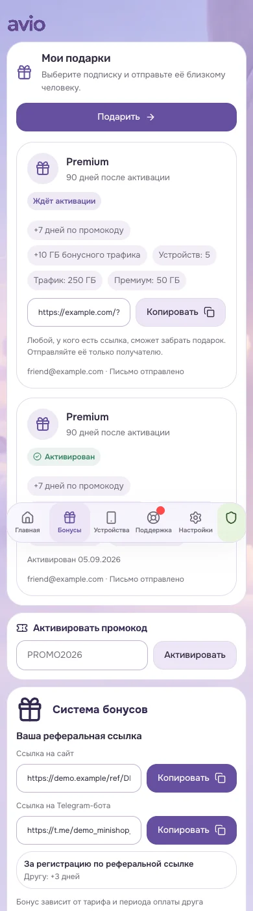 |

| Главная | Тёмный режим | Оплата |
| --- | --- | --- |
| 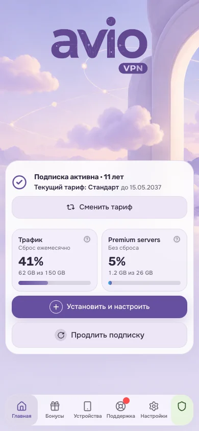 | 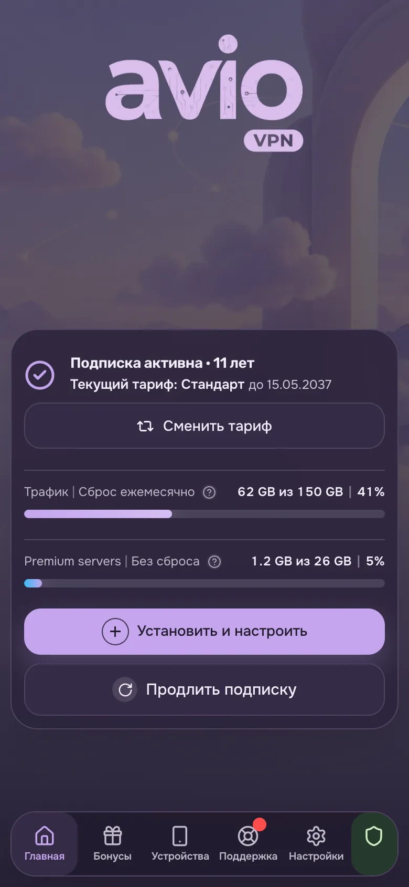 | 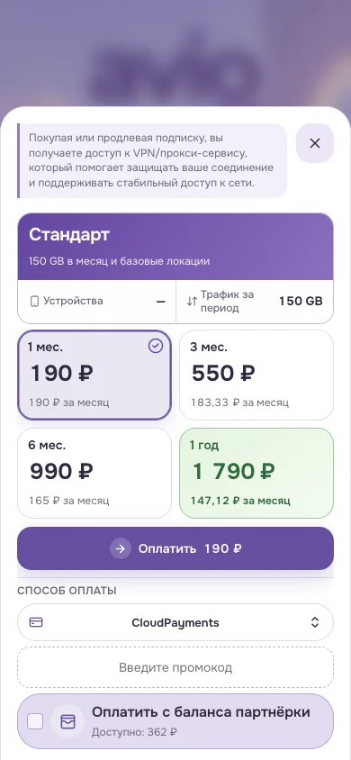 |

| Оплата, тёмный режим | Тарифы, тёмный режим | Установка |
| --- | --- | --- |
| 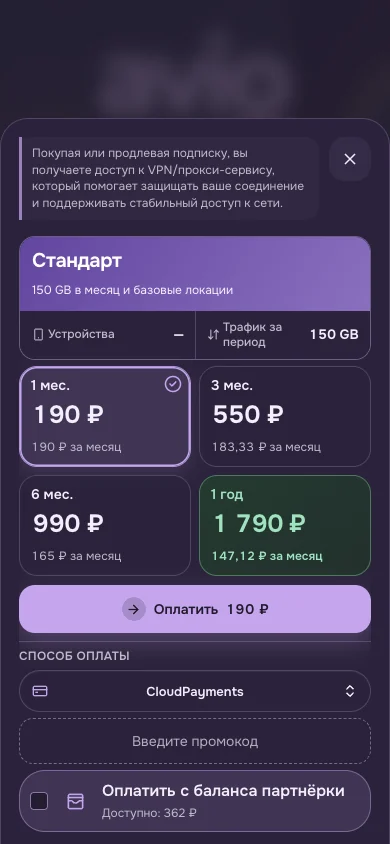 | 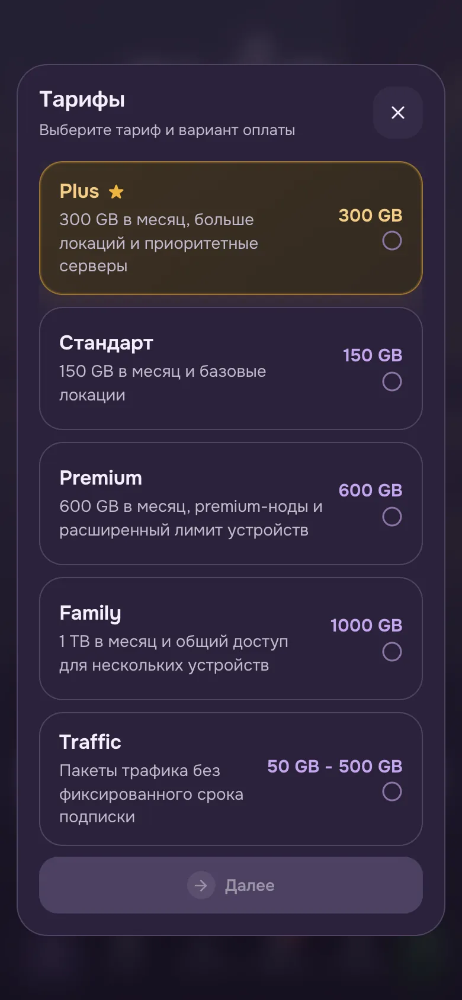 | 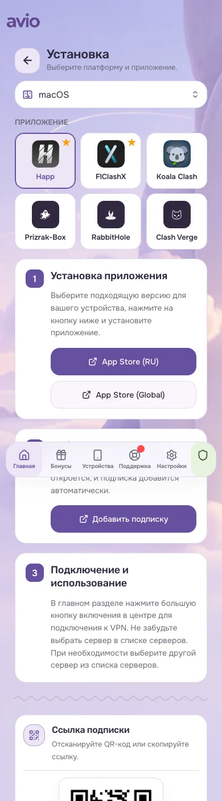 |

| Настройки | Настройки, тёмный режим | Нет подписки |
| --- | --- | --- |
| 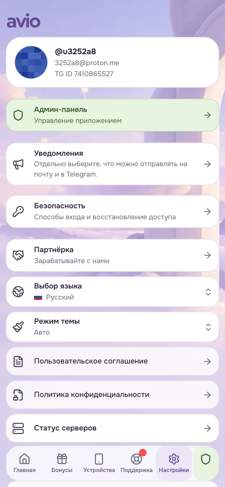 | 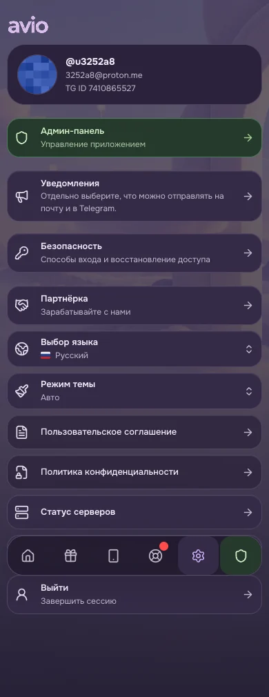 | 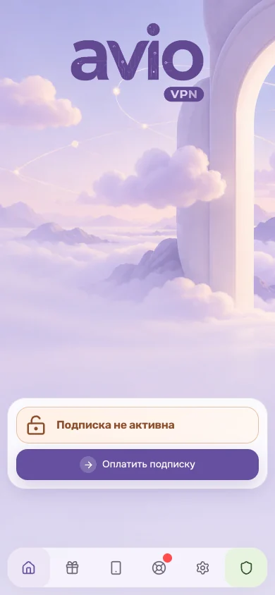 |

| Вход | Устройства без подписки |
| --- | --- |
| 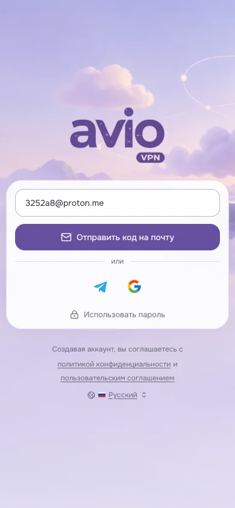 | 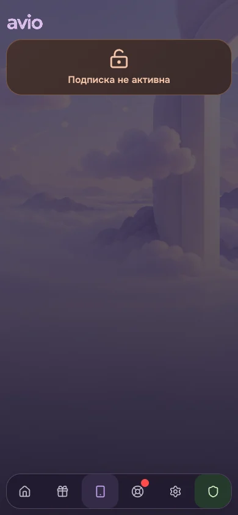 |

## Что уже было в Avio Next 1.6.0 (по сравнению с avio-landing 1.5.15)

**Тёмный режим.** Все цвета, которых нет среди токенов Core, вынесены в переменные
со значениями для светлого и тёмного варианта: выгодный период, выделенный тариф,
статус серверов, отсутствие подписки, админ-панель. В 1.5.15 они оставались светлыми
и на тёмном фоне выглядели как наклейки, а цена за месяц в карточке «1 год»
почти не читалась.

**Движение.** Восемь зацикленных анимаций убраны: «дыхание» кнопок, выбранного периода
и тарифа, блики, покачивание иконки навигации. Кнопку оплаты при открытии чекаута
дважды проходит блик, затем она неподвижна. Отклик на нажатие сохранён.

**Главная.** «Продлить подписку» — вторичная кнопка, пока подписка в порядке. Когда Core
помечает подписку как истекающую (`status-card-warning`), продление становится главной
кнопкой, а «Установить и настроить» уходит на второй план.

**Цвет со смыслом.** Зелёный обозначает только «хорошо»: выгодный период и работающие
серверы, плюс зелёная админ-панель по желанию владельца. Кнопка продления больше не
зелёная. Статус серверов при проблеме переключается на персиковый. Отсутствие подписки
показано тёплым персиковым приглашением, а не красной ошибкой.

**Оплата.** Порядок блоков прежний: кнопка оплаты сразу под периодами. Карточка самого
длинного периода выбирается как последняя (`:last-child`), а не четвёртая, и выделяет
цену за месяц. Подпись кнопки настройки тарифа берётся из её локализованного `title`,
поэтому англоязычные пользователи видят английский текст. Раньше он был зашит по-русски.
На экранах до 360 px кнопка показывает только иконку.

**Поля ввода** стоят на цвете карточки с заметной рамкой и больше не похожи на
вторичные кнопки.

**Мелкий текст.** Надписи 9–10,5 px подняты до 11–12 px: факты тарифа, подписи слайдеров,
цена за месяц, статус серверов.

**Установка.** На телефонах 360–519 px приложения идут по три в ряд (та же 6-колоночная
сетка, что у Core на планшетах). Первый шаг инструкции теперь виден без прокрутки.

**Настройки.** У «Безопасности» и «Политики конфиденциальности» свои иконки (ключ и
документ с замком), щит остался только у админ-панели. Тонкие линии между группами
убраны, юридические строки стали тише.

**Вес пакета.** Фон переведён из PNG 1,6 МБ в WebP 34 КБ. Шрифты урезаны до латиницы
и кириллицы в WOFF2: 553 КБ стали 98 КБ, ось веса сохранена. Иконки приложений
уменьшены до 144 px WebP (было до 341 КБ за штуку). PNG-иконки действий заменены
SVG-масками Lucide, которые красятся цветом текста кнопки. Благодаря этому в тёмном
режиме стрелка на светлой кнопке оплаты тёмная, а не белая.

**CSS.** Заплатки версий 1.5.6–1.5.9 сведены в одно правило на компонент.
Файл сократился с 1735 до 1536 строк, `!important` — с 57 до 31.

## Установка

1. **Админка → Внешний вид → Добавить темы**, загрузите `avio-dock-theme.zip` или
   укажите этот репозиторий с веткой `avio-dock`.
2. Откройте предпросмотр **Avio Dock — Твой интернет** и нажмите **Активировать**, когда
   всё устроит. Прежние версии Avio остаются в библиотеке для отката.
3. Логотип берётся из настроек бренда, как и раньше. Для него подходит
   `images/avio-logo.png` из пакета.

Настройки владельца (палитра, шрифты, масштаб логотипа, прозрачность) сохраняются
отдельно для каждого ключа. Если вы меняли их у другой версии Avio, повторите изменения
у `avio-dock`.

## Настройка в редакторе Core

Переменные ниже Core находит в CSS и показывает в карточке темы для каждого варианта:

- `--avio-backdrop-*` — оттенок и затемнение поверх фоновой картинки;
- `--avio-peach*` — отсутствие подписки и проблемы серверов;
- `--avio-good*` — выгодный период и работающие серверы;
- `--avio-gold*` — выделенный тариф;
- `--avio-admin-*` — строка и кнопка админ-панели;
- `--avio-sky*` — плитка «Устройства» в доке;
- `--avio-dock-bg` — стекло дока;
- `--avio-highlight` — светлый блик по верхнему краю цветных карточек.

Выделенный тариф — второй в порядке админки: в этом магазине это «Премиум». Core не
отдаёт ключ тарифа в разметке, поэтому при смене порядка тарифов золотым станет другой.

## Состав

- `theme.json` — палитры, шрифты, радиусы, варианты `light` и `dark`.
- `style.css` — оформление существующей разметки minishop.
- `images/avio-background.webp` — панорамная иллюстрация.
- `images/avio-logo.png` — прозрачный логотип для настроек бренда.
- `images/app-*.webp` — иконки клиентских приложений, см. `images/APP-ICONS.md`.
- `icons/*.svg` — иконки Lucide (ISC), используются как маски.
- `fonts/*.woff2` и `fonts/*-OFL.txt` — Onest и Rubik под SIL OFL 1.1.
- `preview.webp` — карточка темы 1280×800.

Внешних CSS, запросов к Google Fonts и исполняемого кода в пакете нет.

## Совместимость и проверка

`theme_api: 1`, Core dev от 24.09.2026 (`3312136`). Нужна проверка SVG в пакетах:
она есть в dev с 15.09.2026 (`c7c0315`).

Версия 1.8.0 проверена на demo-сборке Core dev от 24.09.2026 (`3312136`) в Chromium:
главная (активная, истекающая, без подписки, с триалом, с закончившимся трафиком,
со статусом серверов), оплата с дополнениями и без, выбор и смена тарифа, установка,
бонусы, устройства, поддержка, настройки и вход. Оба режима, ширина 320, 390, 1024
и 1440 px. На 156 экранах нет горизонтальной прокрутки, битых картинок и ошибок
JavaScript. Отдельно проверены подсказки и увеличение плиток дока при наведении.

При переходе от 1.5.15 к 1.6.0 сведённый CSS сравнивался с исходным по вычисленным
стилям всех элементов на 70 снимках экранов: расхождений нет.

Контраст новых пар текст/фон не ниже 4,77:1 в светлом режиме и 6,61:1 в тёмном.

Demo заменяет API демонстрационными данными: реальные платежи и авторизация этой
проверкой не покрываются.
